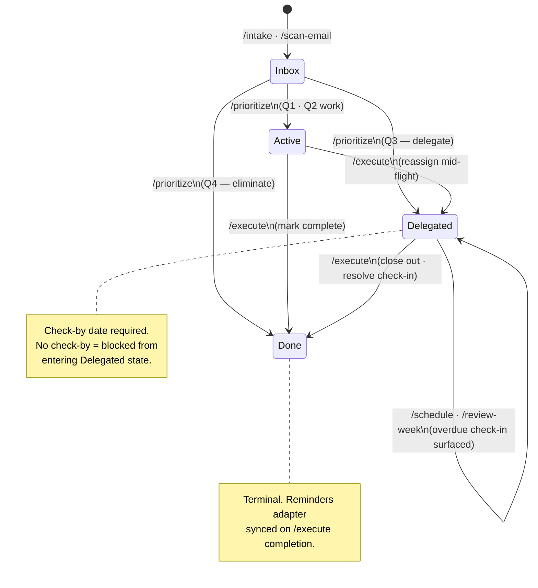
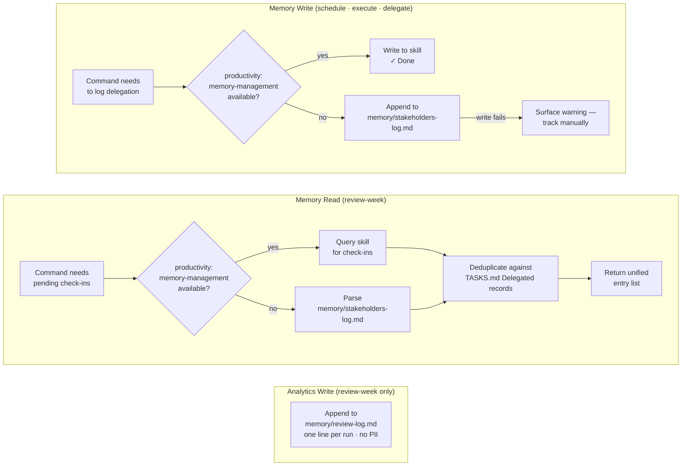

# Architecture Overview

**Last updated**: 2026-03-06
**Version**: v1.1.3

Three diagrams, each answering a different architectural question:

1. **System Architecture** — what components exist and how they relate
2. **Task State Machine** — how a task moves from intake to done
3. **Memory Manager** — how delegation memory is read/written transparently via the unified skill

---

## 1. System Architecture

```mermaid
flowchart TD
    %% ── Input Sources ──────────────────────────────────────────
    subgraph INP["Input Sources"]
        direction LR
        User(["👤 Director"])
        Mail(["📧 Apple Mail"])
    end

    %% ── Commands ───────────────────────────────────────────────
    subgraph CMD["Commands"]
        direction LR
        intake["/intake"]
        prioritize["/prioritize"]
        schedule["/schedule"]
        execute["/execute"]
        delegate["/delegate"]
        scanemail["/scan-email"]
        reviewweek["/review-week"]
        setup["/setup"]
    end

    %% ── Support Layer ──────────────────────────────────────────
    subgraph SUP["Support Layer"]
        direction LR
        eis["claude-eisenhower\nSKILL"]
        enh["skill-enhancer\nSKILL"]
        memmgr["memory-manager\nSKILL"]
        agent["task-prioritizer\nAgent"]
        sshook["SessionStart Hook"]
        nudgehook["enhance-nudge\nPostToolUse Hook"]
    end

    %% ── Scripts ────────────────────────────────────────────────
    subgraph SCR["Scripts"]
        direction LR
        delcore["delegate-core.ts\ndate-helpers.ts\nadapter-types.ts"]
        calq["cal_query.swift\n(EventKit)"]
        remscripts["push_reminder.applescript\ncomplete_reminder.applescript"]
    end

    %% ── Configuration ──────────────────────────────────────────
    subgraph CFG["Configuration  (gitignored)"]
        direction LR
        calcfg["calendar-config.md"]
        emailcfg["email-config.md"]
        taskcfg["task-output-config.md"]
        stk["stakeholders.yaml"]
    end

    %% ── Data Stores ─────────────────────────────────────────────
    subgraph DAT["Data Stores  (gitignored)"]
        direction LR
        tasks[("TASKS.md")]
        mem[("memory/\nglossary.md · people/\nreview-log.md")]
    end

    %% ── External Systems ────────────────────────────────────────
    subgraph EXT["External Systems"]
        direction LR
        maccal[("🗓 Mac Calendar")]
        macrem[("✅ Mac Reminders")]
        pmm(["productivity:\nmemory-management"])
    end

    %% ── Infrastructure ──────────────────────────────────────────
    subgraph INF["Infrastructure"]
        direction LR
        jest["Jest  196 tests"]
        gh["GitHub Actions\nCI · Release"]
    end

    %% ── Connections ─────────────────────────────────────────────

    %% Inputs → Commands
    User -->|"runs"| CMD
    Mail --> scanemail

    %% Commands → core data
    CMD -->|"reads · writes"| tasks
    sshook -->|"reads"| tasks

    %% Calendar integration
    schedule --> calcfg
    scanemail --> calcfg
    reviewweek --> calcfg
    calcfg --> calq --> maccal

    %% Email config
    scanemail --> emailcfg

    %% plugin_root path
    schedule & execute & delegate & reviewweek --> taskcfg

    %% Delegation scoring
    schedule & delegate --> stk --> delcore

    %% Reminders
    schedule --> remscripts --> macrem
    execute --> remscripts

    %% Memory operations — all routed through memory-manager (v1.0.1)
    schedule & execute & delegate & reviewweek -->|"memory ops"| memmgr
    memmgr -->|"primary"| pmm
    memmgr -.->|"fallback"| mem
    reviewweek -->|"analytics"| mem

    %% Support layer
    nudgehook -->|"nudges developer"| enh

    %% Infrastructure
    jest -->|"tests"| delcore
    gh -->|"runs"| jest
    gh -->|"packages"| gh
```

---

## 2. Task State Machine

Four states drive every task record in TASKS.md. The Eisenhower quadrant (Q1–Q4) is
preserved as `Priority:` metadata but is no longer the state driver.

---

## 3. Memory Manager

Introduced in v1.0.1. Unifies all delegation memory operations (read, write, update)
under the `memory-manager` skill (`skills/memory-manager/SKILL.md`). Replaces the
inline try/fallback pattern that was duplicated across 6 command locations.

See `memory-system-adr.md` for the original write contract and `memory-access-layer.md`
(superseded) for the read-only predecessor.

---

## Component Inventory

| Layer | Components |
|-------|-----------|
| Commands | `/intake` `/prioritize` `/schedule` `/execute` `/delegate` `/scan-email` `/review-week` `/setup` |
| Skills | `claude-eisenhower` (end-user routing) · `skill-enhancer` (developer self-improvement) |
| Agents | `task-prioritizer` (autonomous Inbox triage) |
| Hooks | `SessionStart` (task board briefing) · `enhance-nudge` PostToolUse (developer nudge) |
| TypeScript | `delegate-core.ts` · `match-delegate.ts` · `date-helpers.ts` · `adapter-types.ts` |
| AppleScript | `push_reminder.applescript` · `complete_reminder.applescript` |
| Swift | `cal_query.swift` (EventKit — O(1) calendar query) |
| Config | `calendar-config.md` · `email-config.md` · `task-output-config.md` · `stakeholders.yaml` |
| Data (runtime) | `TASKS.md` · `memory/` (stakeholders-log, review-log, people/, glossary) |
| External | Mac Calendar · Mac Reminders · `productivity:memory-management` skill |
| Adapters | `reminders.md` (active) · `jira.md` · `linear.md` · `asana.md` (planned) |
| Infrastructure | Jest (196 tests) · GitHub Actions (CI + tag-based release) |

---

## Key Design Decisions

| Decision | Rationale | Reference |
|----------|-----------|-----------|
| EventKit Swift script instead of AppleScript `whose` | AppleScript `whose` is O(n) and times out on large calendars | `calendar-performance-fix.md` |
| Four-state model (Inbox/Active/Delegated/Done) | Separates action state from Eisenhower priority classification | `four-state-task-model-spec.md` |
| Single write target for memory | Eliminates dual-write split-state problem | `memory-system-adr.md` |
| Memory Access Layer (read abstraction) | Commands read memory without knowing backend; same return shape from skill or local file | `memory-access-layer.md` |
| `delegate-core.ts` as shared module | DRY: scoring logic, types, and constants imported by CLI and tests; never duplicated | `PRINCIPLES.md` |
| No Blocked state | Anti-pattern — creates a holding area with no forcing function; every stuck task needs an action | `four-state-task-model-spec.md` |
